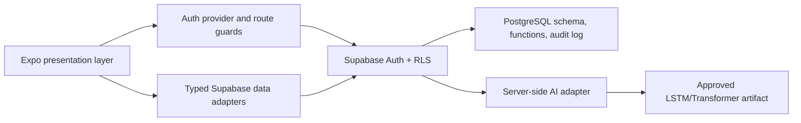

# Architecture

The existing thesis-prescribed stack is preserved: Expo SDK 57, React Native, Expo Router, TypeScript, Supabase/PostgreSQL/Auth/Storage, and an isolated Python AI service boundary.

- Presentation: `apps/mobile/src/app`, `components`, `screens`, `theme`.
- Authentication/authorization: `auth`; backend authorization is RLS and security-definer functions.
- Business logic/validation: `packages/domain`.
- Data access/API: `services/supabase*`, `services/records`; Supabase REST/RPC.
- Database: versioned `supabase/migrations` and fictional seed.
- AI: `services/ai`; fails closed until the approved artifact exists.
- Tests: Vitest domain rules and Playwright role/workflow coverage.
